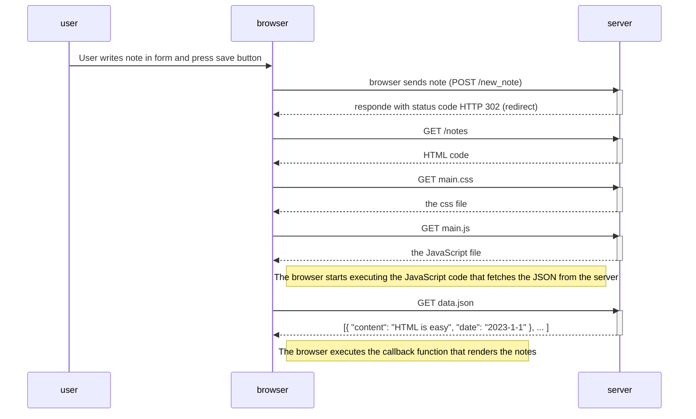

```mermaid
sequenceDiagram
    participant user
    participant browser
    participant server

    user->>browser: User writes note in form and press save button
    browser->>server: browser sends note (POST /new_note)
    
    activate server
    server-->>browser: responde with status code HTTP 302 (redirect)
    deactivate server

    browser->>server: GET /notes
    activate server
    server-->>browser: HTML code
    deactivate server

    browser->>server: GET main.css
    activate server
    server-->>browser: the css file
    deactivate server

    browser->>server: GET main.js
    activate server
    server-->>browser: the JavaScript file
    deactivate server

    Note right of browser: The browser starts executing the JavaScript code that fetches the JSON from the server

    browser->>server: GET data.json
    activate server
    server-->>browser: [{ "content": "HTML is easy", "date": "2023-1-1" }, ... ]
    deactivate server

    Note right of browser: The browser executes the callback function that renders the notes
```