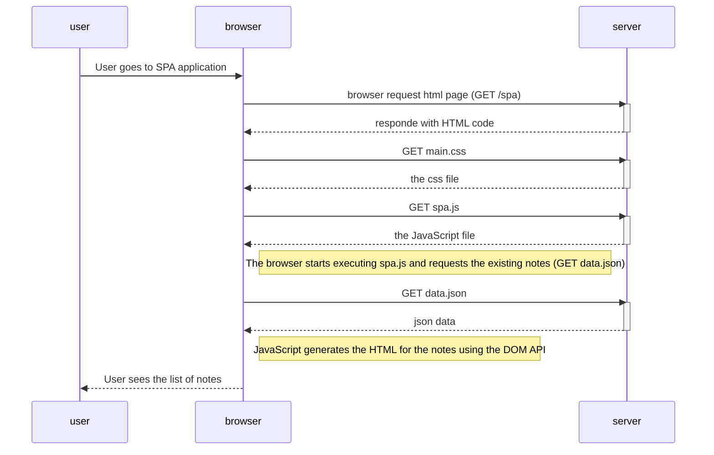

```mermaid
sequenceDiagram
    participant user
    participant browser
    participant server

    user->>browser: User goes to SPA application
    browser->>server: browser request html page (GET /spa)
    activate server
    server-->>browser: responde with HTML code
    deactivate server

    browser->>server: GET main.css
    activate server
    server-->>browser: the css file
    deactivate server

    browser->>server: GET spa.js
    activate server
    server-->>browser: the JavaScript file
    deactivate server

    Note right of browser: The browser starts executing spa.js and requests the existing notes (GET data.json)

    browser->>server: GET data.json
    activate server
    server-->>browser: json data
    deactivate server

    Note right of browser: JavaScript generates the HTML for the notes using the DOM API

    browser-->>user: User sees the list of notes
```