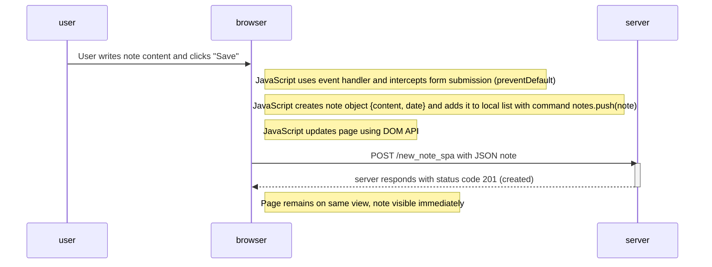

```mermaid
sequenceDiagram
    participant user
    participant browser
    participant server

    user->>browser: User writes note content and clicks "Save"
    Note right of browser: JavaScript uses event handler and intercepts form submission (preventDefault)
    Note right of browser: JavaScript creates note object {content, date} and adds it to local list with command notes.push(note)
    Note right of browser: JavaScript updates page using DOM API
    browser->>server: POST /new_note_spa with JSON note
    activate server
    server-->>browser: server responds with status code 201 (created)
    deactivate server
    Note right of browser: Page remains on same view, note visible immediately

```